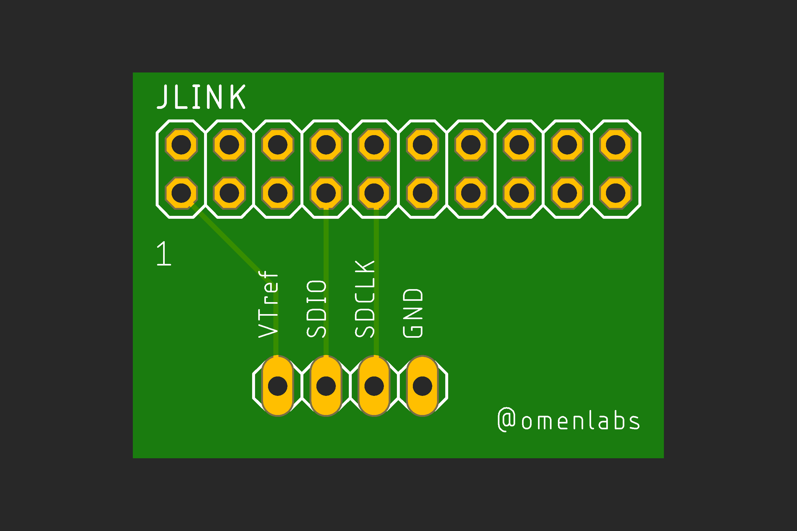

# JLink to Serial Wire Debug (SWD) adapter

This is a simple break-out board for the [SEGGER JLink](https://www.segger.com/products/debug-probes/j-link/).  It breaks out the 20 pin connector into the [four pins](https://www.segger.com/products/debug-probes/j-link/technology/interface-description/) necessary for doing SWD.

